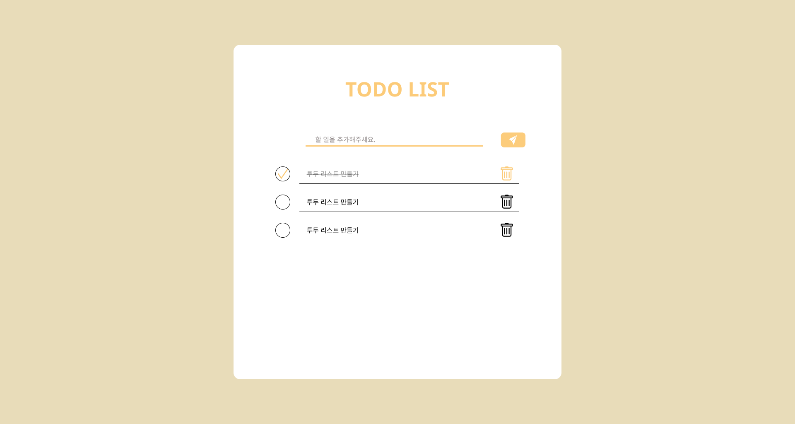

# 리액트를 사용한 투두 리스트 만들기

2022.8.23 ~ 8.29



1. figma로 초기 디자인 꾸려보기

2. React component 세분화하기

3. styled-components 사용하기

4. 기능 구현하기

- useState를 사용하여 todos 추가 항목 관리
- todos 배열을 props로 넘길 때는, todos.map 함수를 사용한다.
- onSubmit을 활용해서 todos 배열에 새 객체 추가
- useRef 활용도 1)포커스 설정 2) state값이 바뀌어도 렌더링없이 값을 관리할 때
- 삭제 기능 todos.filer 함수 사용
- Item 항목 체크 기능 만들기

### 노션 React 투두리스트 정리

<a href="https://wild-gosling-d1a.notion.site/0bda3103f39d4891a766ebc1aa109dc0">

</a>

---

## npm

```bash
npm init # 프로젝트 구성

npm install #패키지.json 라이브러리 쭉 설치

npm i # install의 약자

npm i {패키지이름} # 패키지 설치

npm update #설치한 라이브러리 쭉 업데이트

npm dedupe # 중복된 패키지 정리 -용량 줄이기

npm uninstall {패키지 이름} # 패키지 삭제

npm i -g {패키지 이름} # 내 컴퓨터에 라이브러리 설치

npm i -D {패키지 이름} #프로젝트 개발용(데브디펜던시)로 설치


```

## (npm execution)npx

```bash
npx {패키지 이름} # 패키지 실행
```

## yarn

```bash
yarn init # 프로젝트 구성

yarn  # 패키지제이슨 라이브러리 설치

yarn add {패키지 이름} # 패키지 설치

yarn update #설치한 라이브러리 쭉 업데이트

yarn dedupe # 중복된 패키지 정리 -용량 줄이기

yarn remove {패키지 이름} #패키지 삭제

yarn global add {패키지 이름} # 내 컴퓨터에 라이브러리 설치

yarn add -D {패키지 이름} #프로젝트 개발용(데브디펜던시)로 설치

yarn {패키지 이름} # 패키지 실행
```
